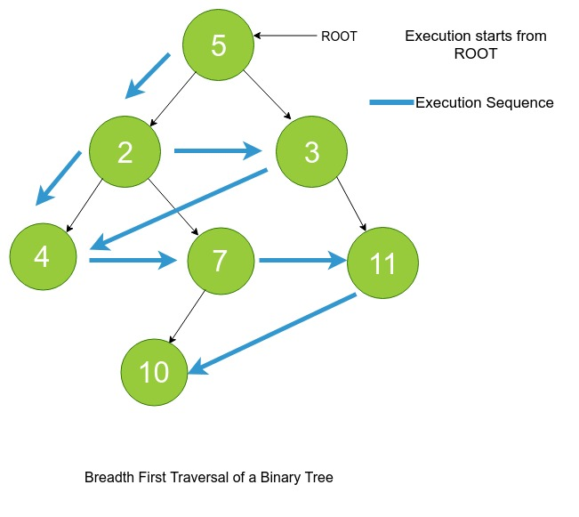

### Basics of BFT
<iframe src="https://www.youtube.com/embed/0a7NuPDgi-w" frameborder="0" allow="autoplay; encrypted-media" allowfullscreen></iframe>

### Definition

In Breadth First Traversal also called as Level Order Traversal of the tree, we traverse the tree in a **breadth first** manner. This means that nodes are traversed level-by-level in the tree from left to right.
### Pictorial Representation of Breadth First Traversal

