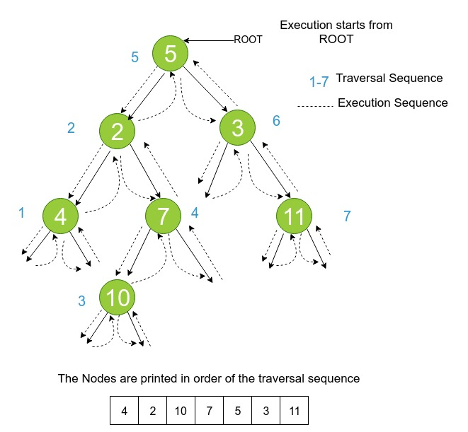
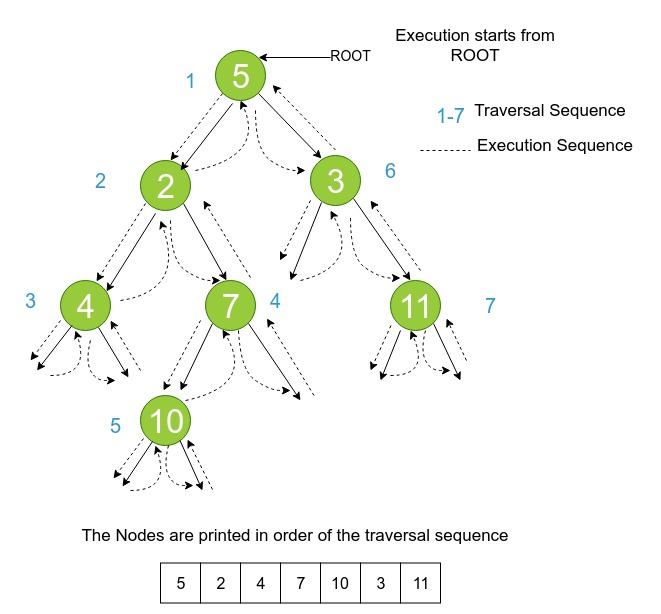

### Introduction

Recursive depth first traversal of a binary tree uses program stack or recursive stack while computing traversal. Thus, we can compute dft using stack or recursive stack.
### Iterative Inorder

**Algorithm**

1. Create a stack.
2. **PUSH** the root of the tree into the stack.
3. Set root to it's left child and continue until root is null.
4. If root is NULL and stack is empty

   - Done

5. Else **POP** a tree node from the top of the stack (let's call it popped_node).

   - Set root = popped_node
   - **Print** the root and set it to its right child.
   - **Goto step 2**

### Pictorial Representation of Iterative Inorder

### Iterative Preorder

**Algorithm**

1. Create a stack.
2. **PRINT** the root.
3. **PUSH** the root into the stack.
4. If root is NULL and stack is empty

   - Done

5. Else POP a tree node from the top of the stack (let's call it popped_node).

   - Set root = popped_node
   - Set root to its right child.
   - **Goto step 2**

### Pictorial Representation of Preorder Traversal

### Iterative Postorder

**Approach**

   - We have seen how we do inorder and preorder traversals without recursion using Stack, But post order traversal will be different and slightly more complex than other two. Reason is post order is non-tail recursive ( The statements execute after the recursive call).
   - If you observe here, postorder traversal is just reverse of preorder traversal.
   - So idea is follow the same technique as preorder traversal and instead of printing it push it to the another Stack so that they will come out in reverse order (LIFO).
   - At the end just pop all the items from the second Stack and print it.

**Try to implement iterative post order traversal yourself!**
