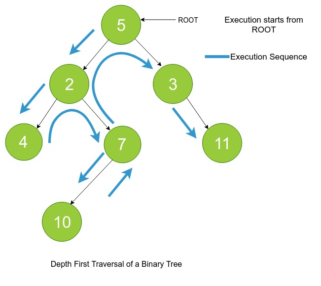
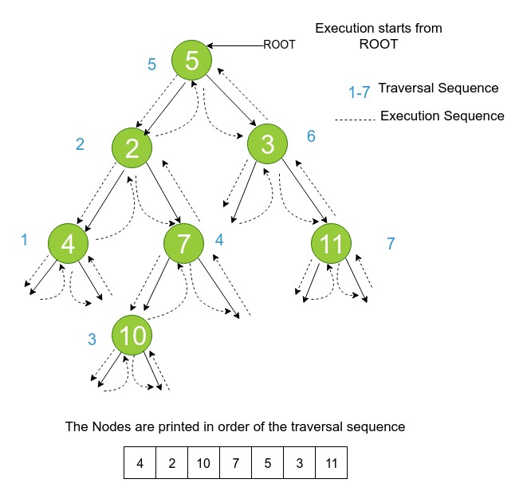

### Basics of DFT
<iframe src="https://www.youtube.com/embed/Oe-T1N3NG54" frameborder="0" allow="autoplay; encrypted-media" allowfullscreen></iframe>

### Definition
As stated earlier, in depth first traversal we start from the root node and keep going down the “depth” of the tree until we reach a leaf node (a node having no children) and then traverse back again to the node we started with.

Here, we discuss **recursive** depth first traversal technique. It is called recursive because the depth first traversal of a binary tree uses **program stack/recursion stack** while computing the traversal instead of iterating over the tree data structure in a loop.

### Pictorial Representation of Depth First Traversal

### Types
The order in which we travese the root and sub-trees – left subtree and right subtree gives rise to three different kinds of depth first traversals.

**1. In-Order Traversal**
**2. Pre-Order Traversal**
**3. Post-Order Traversal**

### Inorder Traversal
   - Inorder traversal is a strategy of depth first traversal of a tree in which we traverse the left subtree, then the root node and finally the right sub-tree. This process repeats recursively until we have traversed all the nodes in the tree.
   - In short, an inorder traversal can be summarized as visiting - Left-Subtree => Root => Right-Subtree

### Pictorial Representation of Inorder

### Preorder Traversal
  -  Preorder traversal is a strategy of depth first traversal of a tree in which we traverse the root node(or the current node), the the left subtree and finally the right sub-tree. This process repeats recursively until we have traversed all the nodes in the tree.
  -  In short, a preorder traversal can be summarized as visiting - Root => Left-Subtree => Right-Subtree

### Pictorial Representation of Preorder Traversal

### Postorder Traversal
   - Postorder traversal is a strategy of depth first traversal of a tree in which we traverse the left subtree.then the right subtree and finally the root node(or the current node). This process repeats recursively until we have traversed all the nodes in the tree.
   - In short, a postorder traversal can be summarized as visiting - Left-Subtree => Right-Subtree => Root

### Pictorial Representation of Postorder Traversal

