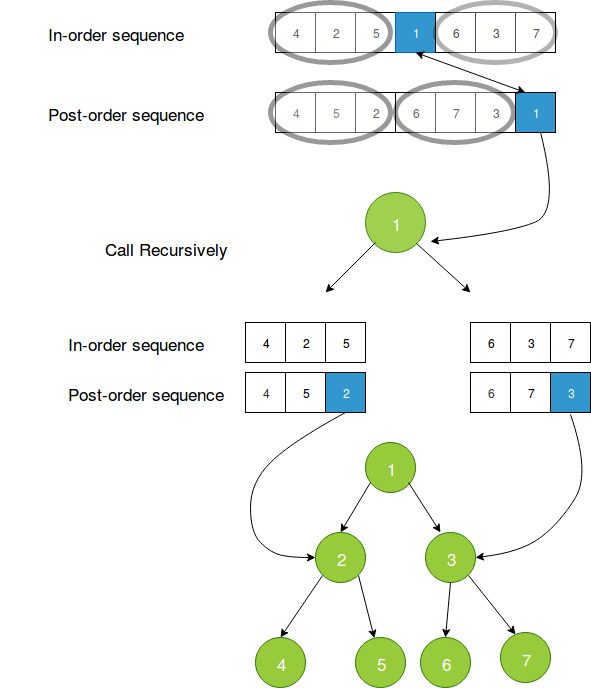

### Reconstructing binary tree from Inorder and Postorder traversal
   - Given an Inorder and Postorder traversal of a binary tree, it can be uniquely re-constructed.
   - As explained in the previous module, the last element in the post order traversal of a tree is the root. Whereas, in an Inorder traversal the root of the tree lies somewhere in the middle.
   - Using this knowledge, let us see how we can re-construct the binary tree.

### Algorithm for Tree construction from Inorder and Postorder

Consider the following traversals of the tree. 
**Inorder** = { 4, 2, 5, 1, 6, 3, 7 }  
**Postorder** = { 4, 5, 2, 6, 7, 3, 1 } 

**Steps of construction:**

1. Last element in the postorder[] will be the root of the tree, here it is 1.

2. Now the search ele­ment 1 in inorder[], say you find it at posi­tion i, once you find it, make note of ele­ments which are left to i (this will con­struct the left­sub­tree) and ele­ments which are right to i ( this will con­struct the rightSubtree).

3. Suppose in previous step, there are X number of elements which are left of ‘i’ (which will construct the leftsubtree), take first X elements from the postorder[] traversal, this will be the post order traversal for elements which are left to i. similarly if there are Y number of elements which are right of ‘i’ (which will construct the rightsubtree), take next Y elements, after X elements from the postorder[] traversal, this will be the post order traversal for elements which are right to i.

4. From previous two steps construct the left and right subtree and link it to root.left and root.right respectively.
5. 
### Pictorial Representation of above questions

