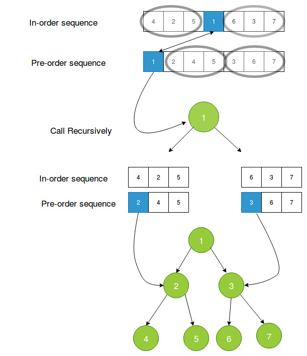

### Reconstructing binary tree from Inorder and Preorder traversal

- Given an Inorder and Preorder traversal of a binary tree, it can be uniquely re-constructed.

- As explained in the previous module, the first element in the Preorder traversal of a tree is the root. Whereas, in an Inorder traversal the root of the tree lies somewhere in the middle.

- Using this knowledge, let us see how we can re-construct the binary tree.

### Algorithm: Tree construction from Inorder and Preorder

Consider the following traversals of the tree.
**Inorder** = {2, 5, 6, 10, 12, 14, 15}
**Preorder** = {10, 5, 2, 6, 14, 12, 15}
**Steps of construction:**

1. First element in Preorder will be the root of the tree, here its 10.

2. Now the search element 10 in inorder[], say you find it at position i, once you find it, make note of elements which are left to i (this will construct the leftsubtree) and elements which are right to i ( this will construct the rightsubtree).

3. See this step above and recursively construct left subtree and link it root.left and recursively construct right subtree and link it root.right.
Pictorial Representation of above questions

### Pictorial Representation of above questions

